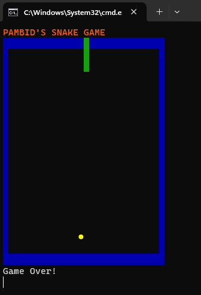

# Snake raja
A visual game of snake by using python's print function.

## Installation
```bash
# Executed on Python3.7.8
pip install -r requirements.txt
python Snake_Game_V2.py
```

## How to Play?
1. Use Arrow Keys to Control the Snake.



## Tip
**If you like my hard work, I would appreciate it if you could buy some coffee for me.**

[](https://www.buymeacoffee.com/frosteen)
